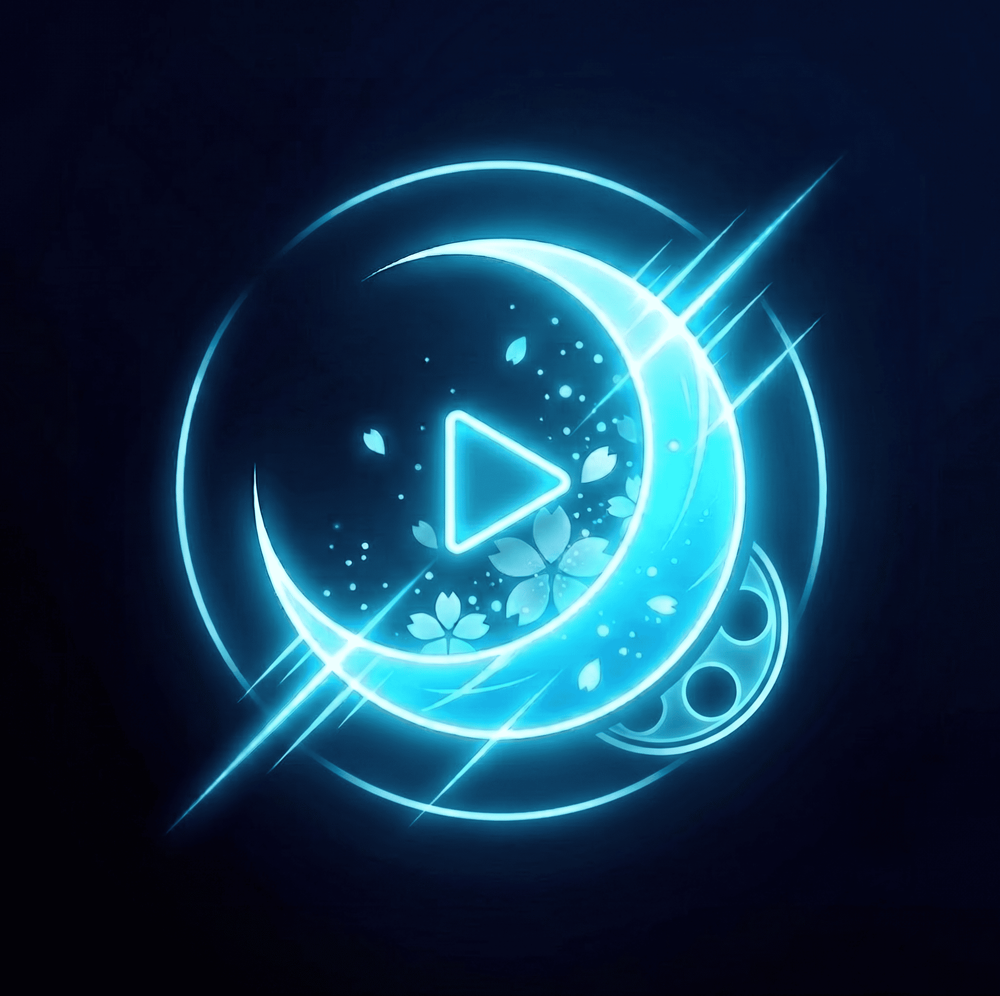

# 🎬 MoonPelis — Plataforma de Streaming Cinematográfico

  

<h3 align="center">MoonPelis</h3>

  Plataforma web auto-alojada (<i>self-hosted</i>) para buscar y reproducir películas y series en línea en alta definición.

  
  
  

---

## 🌟 Características

* **⚡ Scraper Multi-Proveedor**: PelisPlus y RePelisHD con búsqueda agregada concurrente.
* **📺 Reproducción en Streaming**: Modal cinemático con selector de servidor de alta velocidad y variantes de audio (Latino, Castellano, Subtitulado).
* **👤 Gestión de Usuarios y Membresías**: Sistema de expiración automática de accesos temporales con panel de administración para otorgar días adicionales.
* **🎨 Tema Cinematográfico Deep Obsidian & Neon Cyan**: Diseñado aplicando la skill **UI/UX Pro Max** con acabados en cristal (*glassmorphism*) y acentos cian neón.

---

## 🤝 Créditos
* **Motor Scraper & Resolvedor**: [FxxMorgan (PeliApi)](https://github.com/FxxMorgan/PeliApi)
